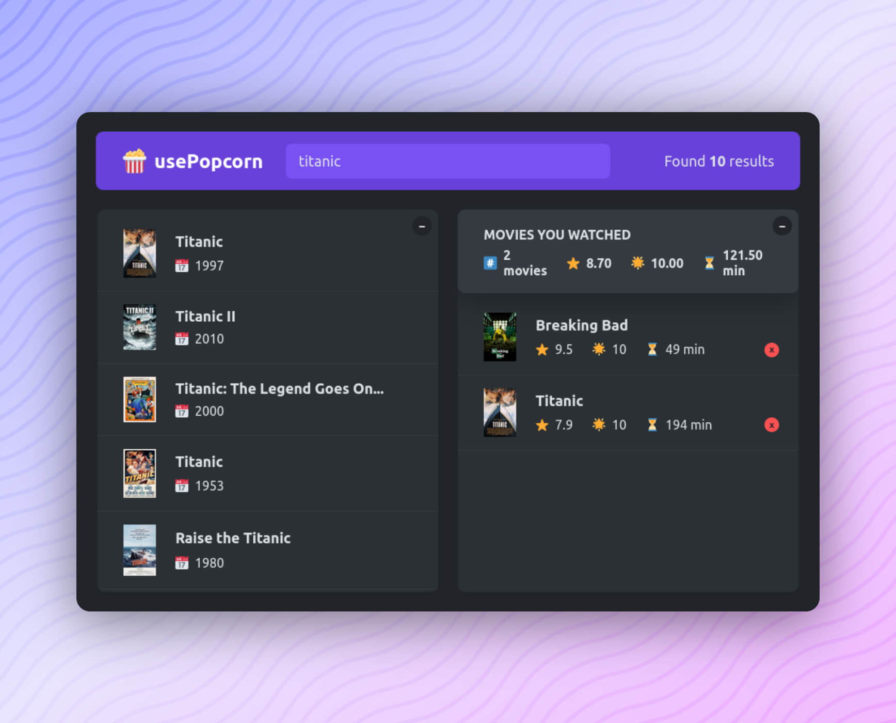

<div align="center">

  <h2>usePopcorn</h2>

  <h3>
    <a href="https://use-popcorn-codepapa.vercel.app">
      <strong>View Demo</strong>
    </a> 
  </h3>

  <div align="center">
    <a href="https://github.com/CodePapa360/usePopcorn/issues">Report Bug</a>
    •
    <a href="https://github.com/CodePapa360/usePopcorn/pulls">Request Feature</a>
  </div>

  <hr>

</div>

<!-- Badges -->
<div align="center">

<!-- Status -->


<!-- Liceensee -->


<a href='https://www.twitter.com/CodePapa360' target="_blank"></a>
<a href='https://www.linkedin.com/in/codepapa360' target="_blank"></a>

</div>

<!-- Brief -->
<p align="center">
Discover, rate, and track your favorite movies with usePopcorn. This React-based web app features a responsive design, intuitive interface, and interactive movie rating.
</p>

<!-- Screenshot -->
<a align="center" href="https://use-popcorn-codepapa.vercel.app">



</a>

## Table of contents📚

- [Key Features](#key-features)
- [Links](#links)
- [My process](#my-process)
  - [Built with](#built-with)
- [Installation](#installation)
- [Author](#author)
- [Acknowledgments](#acknowledgments)

## Key Features🎉

Users should be able to:

- **Search for Favorite Movies:**
  Users can easily search for their favorite movies on the platform.

- **Rate Movies on a Scale of 1 to 10:**
  Users have the option to rate any specific movie on a scale from 1 to 10.

- **View Rated Movies in the Watched Section:**
  Rated movies are neatly organized in the "Watched" section, accompanied by additional information.

- **Remove Movies from the Watched List:**
  Users can effortlessly remove any specific movie from their watched list.

- **Responsive Design for Optimal Layout:**
  The website adapts to different screen sizes, providing users with an optimal layout for a seamless experience on various devices.

- **Interactive Hover States:**
  Users can explore hover states for all interactive elements on the page, enhancing the overall interactivity of the website.

## Links

- View Demo - https://use-popcorn-codepapa.vercel.app

## My process🛠️

### Tech Stack🏗️

- React
- API
- CSS
- Html

## Installation📥

- Clone this repo:

```sh
git clone https://github.com/CodePapa360/usePopcorn.git
```

- Install dependencies:

```sh
npm install
```

- Build command:

```sh
npm run build
```

- Live server:

```sh
npm run dev
```

## Author👤

<b>Alamin</b>

- Twitter - [@CodePapa360](https://www.twitter.com/CodePapa360)
- LinkedIn - [@CodePapa360](https://www.linkedin.com/in/codepapa360)
- Frontend Mentor - [@CodePapa360](https://www.frontendmentor.io/profile/CodePapa360)
- Github: [@CodePapa360](https://github.com/codepapa360)

Feel free to contact me with any questions or feedback!

## Star this project🌟

Show your appreciation by starring this project on GitHub.🙂 Your support will motivate me to continue creating and sharing valuable open-source projects

## Acknowledgments🙏

This app was developed as part of the [Udemy course](https://www.udemy.com/course/the-ultimate-react-course) "The Ultimate React Course 2023: React, Redux & More" by [Jonas Smechmann](https://twitter.com/jonasschmedtman). Special thanks to Jonas for his exceptional teaching and guidance during the course.
